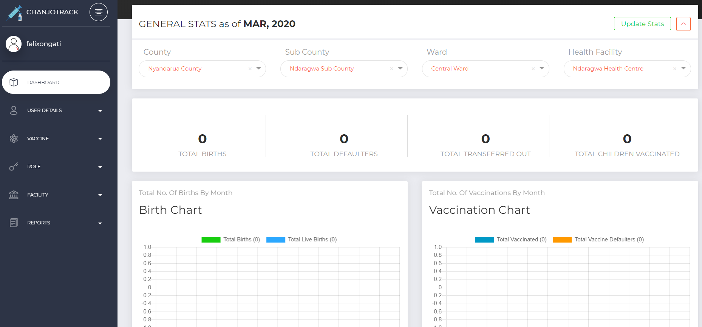

Dashboard
=========
Once you login successfully, you will be directed to a summary dashboard that has two bar charts; one for total number of births by month and another one displaying total number of child vaccinations per month for your assigned facility. The dashboard also has a menu on the left side from where you can access different modules in the system based on your user role. Image 3 below shows a general dashboard for a system administrator;

**Image 3: Dashboard**
