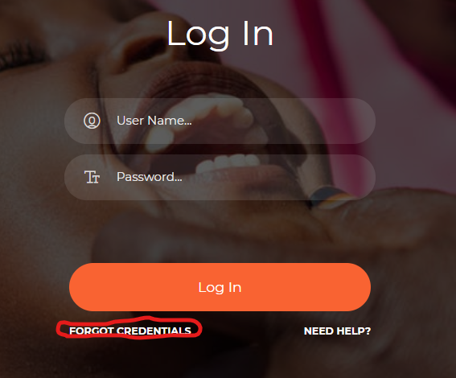
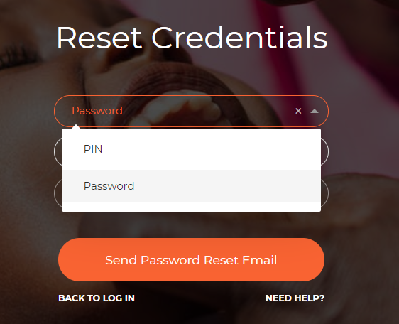

Reset PIN/Password
==================
The login page provides a way in which users can reset their credentials. In the case that you have forgotten your password or PIN, navigate to the login page and click on **FORGOT CREDENTIALS** link. 

**Image 16:** *Forgot Credentials*

Once you click on the link, you will be directed to a Reset Credentials page as on image 17 below;

**Image 17:** *Reset Credentials*

On this page;

1. Select whether you want to reset your PIN or password.
2. Then select whether you want to have the new credentials send to you via SMS or email
3. Then click on the Send Password Reset email or SMS button. You will receive new credentials through the medium you selected.

